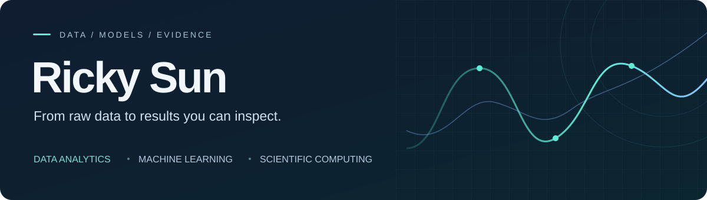

  

  <a href="https://www.linkedin.com/in/ricky-sun0704/">LinkedIn</a> &nbsp; / &nbsp;
  <a href="https://github.com/Prayboy-88?tab=repositories">All repositories</a>

I'm Ricky, a UC Irvine graduate in **Applied & Computational Mathematics**, with a minor in **Statistics**. I build reproducible data analyses and machine learning projects, from raw data and SQL to model evaluation and clear reports.

My interests span product analytics, forecasting, and scientific computing. I care about defining metrics carefully, testing assumptions, and making results easy to inspect.

## Selected projects

<table>
<tr>
<td width="36%">

</td>
<td>
<h3><a href="https://github.com/Prayboy-88/video-engagement-analytics">Video Engagement Analytics</a></h3>

What drove a change in watch time, and how does viewing behavior relate to audience return?

<strong>11.76M source events</strong> from KuaiRand-1K. SQL marts, watch-time decomposition, and audience-return analysis with explicit metric contracts.

<code>Python</code> <code>SQL</code> <code>DuckDB</code>

<a href="https://github.com/Prayboy-88/video-engagement-analytics#findings">Findings</a> · <a href="https://github.com/Prayboy-88/video-engagement-analytics/blob/main/notebooks/engagement_analysis.ipynb">Notebook</a>
</td>
</tr>
<tr>
<td width="36%">

</td>
<td>
<h3><a href="https://github.com/Prayboy-88/ecommerce-funnel-retention">Ecommerce Funnel &amp; Retention</a></h3>

Where do sessions drop off, and how often do observed users return?

<strong>3.53M source events</strong>. Sequential session funnels, cohort repeat activity, and sensitivity checks for duplicates and timestamp ordering.

<code>SQL</code> <code>DuckDB</code> <code>Streamlit</code>

<a href="https://github.com/Prayboy-88/ecommerce-funnel-retention#verified-results">Results</a> · <a href="https://github.com/Prayboy-88/ecommerce-funnel-retention/blob/main/notebooks/ecommerce_funnel_retention.ipynb">Notebook</a>
</td>
</tr>
<tr>
<td width="36%">

</td>
<td>
<h3><a href="https://github.com/Prayboy-88/nyc-taxi-demand-forecasting">NYC Taxi Demand Forecasting</a></h3>

Can a 24-hour-ahead forecast outperform seasonal baselines?

<strong>108.9M source trip records</strong>. Gradient boosting reached <strong>16.19% holdout WAPE</strong> versus 20.27% for the weekly baseline, across 20 pickup zones.

<code>Python</code> <code>scikit-learn</code> <code>DuckDB</code>

<a href="https://github.com/Prayboy-88/nyc-taxi-demand-forecasting#results">Evaluation</a> · <a href="https://github.com/Prayboy-88/nyc-taxi-demand-forecasting#reproducibility-and-artifact-qa">Run the project</a>
</td>
</tr>
</table>

Independent projects using public datasets. Dataset sizes refer to source records before filtering. Full methods, checks, and interpretation limits are documented in each repository.

## How I work

- **Start with the question.** Define the population, time window, and metric before writing the analysis.
- **Make the work reproducible.** Keep source manifests, readable SQL, validation checks, and published artifacts together.
- **Evaluate honestly.** Use chronological splits for forecasting, compare against baselines, and report limitations alongside results.

**Analysis** &nbsp; Python · SQL · DuckDB · pandas 
**Modeling** &nbsp; scikit-learn · Statistical modeling · Time-series forecasting 
**Presentation & workflow** &nbsp; Jupyter · Streamlit · Matplotlib · Git · GitHub Actions

---

Interested in data, ML, or research engineering? [Let's connect on LinkedIn.](https://www.linkedin.com/in/ricky-sun0704/)
